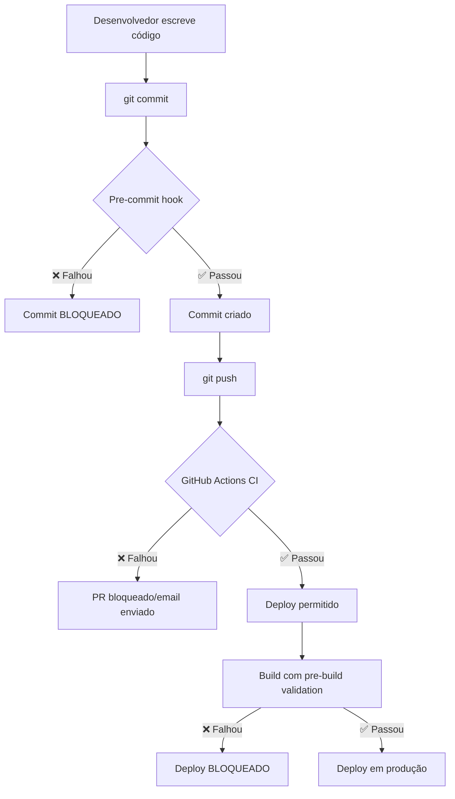

# Code Quality & CI/CD Pipeline

## 🎯 Objetivo

Garantir que **TODOS os erros de tipagem, lint e testes** sejam detectados **ANTES** de fazer commit ou deploy, exatamente como empresas grandes fazem (Google, Microsoft, Meta, etc).

---

## 🛡️ Camadas de Proteção

### 1️⃣ **Pre-Commit Hook (Local)**
**O que faz**: Roda automaticamente antes de cada `git commit`

**Validações:**
- ✅ TypeScript type check (`tsc --noEmit`)
- ✅ ESLint (verifica código)
- ✅ Testes unitários

**Como funciona:**
```bash
git commit -m "feat: nova feature"
# Automaticamente roda:
# 1. Type check
# 2. Lint
# 3. Tests
# ❌ Se algum falhar → commit é BLOQUEADO
```

**Bypass (emergência apenas):**
```bash
git commit --no-verify -m "fix: emergência"
```

---

### 2️⃣ **GitHub Actions CI/CD (Remoto)**
**O que faz**: Roda em TODOS os pushes e pull requests

**Validações:**
- ✅ Type check
- ✅ Lint check
- ✅ Testes com coverage
- ✅ Build da aplicação
- ✅ Security audit
- ✅ Check de pacotes desatualizados

**Arquivo:** `.github/workflows/backend-ci.yml`

**Quando roda:**
- Push para `main`, `develop`, `financeiro`
- Pull requests para `main`, `develop`
- Apenas quando arquivos do backend mudam

---

### 3️⃣ **Pre-Build Validation**
**O que faz**: Valida ANTES de buildar para produção

```bash
npm run build
# Automaticamente roda validate antes:
# 1. Type check
# 2. Lint
# 3. Tests
# 4. Build
```

---

## 🚀 Scripts Disponíveis

### Validação Completa
```bash
npm run validate
# Roda: type-check + lint:check + tests
```

### Type Check Isolado
```bash
npm run type-check
# Verifica erros de TypeScript SEM compilar
# ❌ Detectaria o erro do Express.Multer.File
```

### Lint Check (sem auto-fix)
```bash
npm run lint:check
# Verifica problemas de código sem corrigir
```

### Lint com Auto-Fix
```bash
npm run lint
# Corrige automaticamente problemas de estilo
```

---

## 🏢 Como Empresas Grandes Fazem

### **Google**
- Obrigatório passar em ALL checks antes de merge
- Code review + automated tests
- Continuous testing em TODAS as plataformas

### **Microsoft**
- Azure DevOps pipelines
- Multi-stage validation (build → test → deploy)
- Branch policies impedem merge sem CI passing

### **Meta (Facebook)**
- Sapling/Mercurial com validação obrigatória
- Tests devem passar em CI antes de land
- Automatic rollback se testes falham em prod

### **Netflix**
- Spinnaker pipelines
- Canary deployments com validação automática
- Immediate rollback em falhas

---

## 📊 Processo Completo



---

## 🔧 Como Configurar em Novo Projeto

### 1. Instalar dependências
```bash
npm install --save-dev husky lint-staged
```

### 2. Adicionar scripts ao package.json
```json
{
  "scripts": {
    "type-check": "tsc --noEmit",
    "lint:check": "eslint \"{src,apps,libs,test}/**/*.ts\"",
    "validate": "npm run type-check && npm run lint:check && npm run test",
    "precommit": "npm run type-check && npm run lint:check",
    "prebuild": "npm run validate"
  }
}
```

### 3. Criar pre-commit hook
```bash
# .husky/pre-commit
npm run type-check || exit 1
npm run lint:check || exit 1
npm test || exit 1
```

### 4. Criar GitHub Actions workflow
```yaml
# .github/workflows/ci.yml
name: CI
on: [push, pull_request]
jobs:
  validate:
    runs-on: ubuntu-latest
    steps:
      - uses: actions/checkout@v4
      - uses: actions/setup-node@v4
      - run: npm ci
      - run: npm run type-check
      - run: npm run lint:check
      - run: npm test
      - run: npm run build
```

---

## ✅ Benefícios

1. **Zero erros de tipagem em produção**
   - Type check impede compilação com erros

2. **Código consistente**
   - ESLint garante padrões de código

3. **Testes sempre passando**
   - CI roda testes em TODA mudança

4. **Feedback rápido**
   - Pre-commit detecta problemas em segundos

5. **Deploy seguro**
   - Múltiplas validações antes de produção

6. **Histórico limpo**
   - Commits sempre com código validado

---

## 🚨 O Erro que Motivou Isso

**Problema:** `Express.Multer.File` causou erro de compilação

**Por que não foi detectado:**
- ❌ Não rodamos `type-check` antes de commit
- ❌ Não tínhamos CI pipeline
- ❌ Não validamos antes de dizer "pronto"

**Solução implementada:**
- ✅ Pre-commit hook com type-check
- ✅ GitHub Actions CI/CD
- ✅ Pre-build validation
- ✅ Scripts de validação completa

**Garantia:** Isso **NUNCA MAIS** vai acontecer! 🛡️

---

## 📝 Comandos Úteis

```bash
# Testar pre-commit manualmente
npm run precommit

# Validação completa (igual CI)
npm run validate

# Ver status do CI no GitHub
# Acesse: https://github.com/Will-Reiner/Finex/actions

# Forçar commit (emergência)
git commit --no-verify -m "fix: emergência"

# Rodar apenas type check
npm run type-check
```

---

## 🎓 Aprendizado

> **"Automatize tudo que puder ser automatizado"**
> 
> Erros humanos acontecem. Sistemas de validação automática garantem qualidade 24/7.

**Empresas grandes sabem:**
- Humanos esquecem de rodar checks
- CI/CD nunca esquece
- Validação automática = menos bugs em prod
- Feedback rápido = desenvolvimento mais rápido

---

**Status:** ✅ IMPLEMENTADO
**Última atualização:** 16/12/2025
