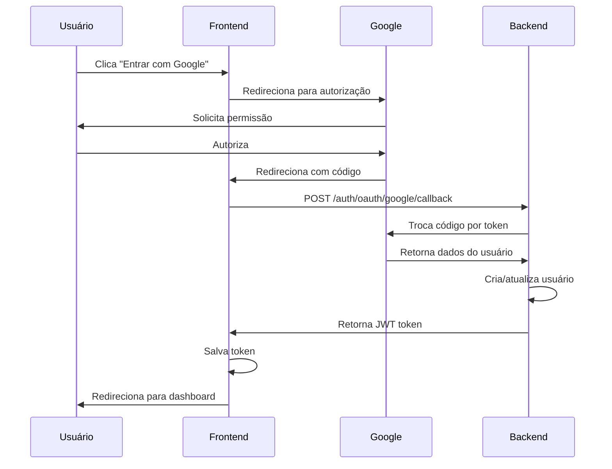

# 🔐 Guia de Configuração - Login com Google OAuth

Este guia explica como configurar o login com Google no FinEx.

---

## 📋 **Pré-requisitos**

- Conta Google (Gmail)
- Projeto no Google Cloud Console
- Backend do FinEx rodando em `http://localhost:3000`
- Frontend do FinEx rodando em `http://localhost:5173`

---

## 🚀 **Passo a Passo**

### **1. Criar Projeto no Google Cloud Console**

1. Acesse [Google Cloud Console](https://console.cloud.google.com/)
2. Clique em **"Select a project"** > **"New Project"**
3. Nomeie o projeto (ex: "FinEx OAuth")
4. Clique em **"Create"**

### **2. Configurar OAuth Consent Screen**

1. No menu lateral, vá em **"APIs & Services"** > **"OAuth consent screen"**
2. Selecione **"External"** (para testar com qualquer conta Google)
3. Clique em **"Create"**
4. Preencha as informações obrigatórias:
   - **App name**: FinEx
   - **User support email**: Seu email
   - **Developer contact**: Seu email
5. Clique em **"Save and Continue"**
6. Em **"Scopes"**, clique em **"Add or Remove Scopes"**
7. Adicione os escopos:
   - `userinfo.email`
   - `userinfo.profile`
   - `openid`
8. Clique em **"Save and Continue"**
9. Em **"Test users"**, adicione seu email para teste
10. Clique em **"Save and Continue"**

### **3. Criar Credenciais OAuth**

1. Vá em **"APIs & Services"** > **"Credentials"**
2. Clique em **"Create Credentials"** > **"OAuth client ID"**
3. Selecione **"Web application"**
4. Configure:
   - **Name**: FinEx Web Client
   - **Authorized JavaScript origins**:
     ```
     http://localhost:5173
     ```
   - **Authorized redirect URIs**:
     ```
     http://localhost:5173/auth/google/callback
     ```
5. Clique em **"Create"**
6. **COPIE** o **Client ID** gerado (você vai precisar dele!)

### **4. Configurar o Frontend**

1. Abra o arquivo `.env` na pasta `frontend/`
2. Cole o Client ID copiado:
   ```env
   VITE_GOOGLE_CLIENT_ID=SEU_CLIENT_ID_AQUI.apps.googleusercontent.com
   ```
3. Salve o arquivo

### **5. Configurar o Backend**

1. Abra o arquivo `.env` na pasta `backend/`
2. Adicione as configurações do Google:
   ```env
   GOOGLE_CLIENT_ID=SEU_CLIENT_ID_AQUI.apps.googleusercontent.com
   GOOGLE_CLIENT_SECRET=SEU_CLIENT_SECRET_AQUI
   ```
   
   **Nota:** O Client Secret está na mesma tela onde você copiou o Client ID.

### **6. Reiniciar os Servidores**

```bash
# Terminal 1 - Backend
cd backend
npm run start:dev

# Terminal 2 - Frontend
cd frontend
npm run dev
```

---

## ✅ **Testar o Login com Google**

1. Acesse `http://localhost:5173/login`
2. Clique no botão **"Entrar com Google"**
3. Selecione sua conta Google
4. Autorize o acesso
5. Você será redirecionado de volta ao FinEx e autenticado automaticamente! 🎉

---

## 🔧 **Solução de Problemas**

### **Erro: "redirect_uri_mismatch"**

**Causa:** A URI de redirecionamento não está configurada no Google Cloud Console.

**Solução:**
1. Vá em **"APIs & Services"** > **"Credentials"**
2. Clique no seu OAuth client ID
3. Adicione exatamente esta URI:
   ```
   http://localhost:5173/auth/google/callback
   ```

### **Erro: "invalid_client"**

**Causa:** Client ID ou Client Secret incorretos.

**Solução:**
1. Verifique se copiou corretamente o Client ID e Secret
2. Certifique-se que não há espaços extras
3. Reinicie o backend após alterar o `.env`

### **Botão não funciona**

**Causa:** Client ID não configurado no frontend.

**Solução:**
1. Verifique se o arquivo `.env` existe em `frontend/`
2. Verifique se o Client ID está correto
3. Reinicie o frontend (`npm run dev`)

---

## 🌐 **Configuração para Produção**

Quando for colocar em produção:

1. **Atualize as URIs autorizadas** no Google Cloud Console:
   ```
   https://seu-dominio.com
   https://seu-dominio.com/auth/google/callback
   ```

2. **Atualize o `.env` do frontend**:
   ```env
   VITE_API_URL=https://api.seu-dominio.com
   VITE_GOOGLE_CLIENT_ID=seu-client-id.apps.googleusercontent.com
   ```

3. **Publique o app** no OAuth Consent Screen (mude de Testing para Production)

---

## 📚 **Recursos Adicionais**

- [Documentação OAuth 2.0 do Google](https://developers.google.com/identity/protocols/oauth2)
- [Google Cloud Console](https://console.cloud.google.com/)
- [Configurar OAuth Consent Screen](https://support.google.com/cloud/answer/6158849)

---

## 🎯 **Fluxo OAuth Implementado**



---

**Pronto!** 🚀 Seu login com Google está configurado!
